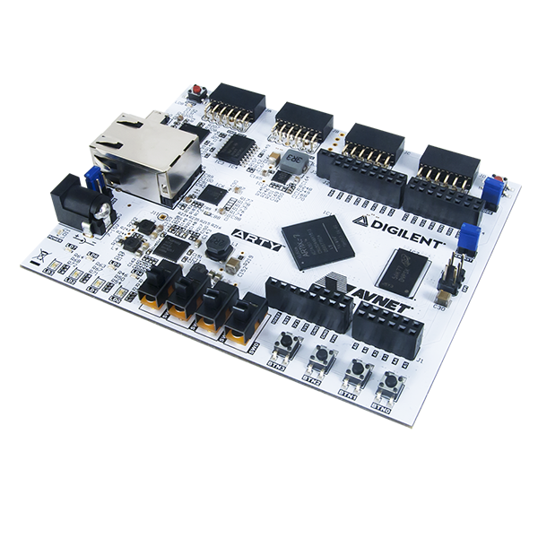

# RISC-V Test SoC

Github: http://github.com/ultraembedded/riscv_soc

A basic RISC-V test SoC with Timer, UART, SPI and GPIO peripherals...

## Cloning
```
# Clone repository and submodules
git clone https://github.com/ultraembedded/riscv_soc.git --recursive
```

## Directories

| Name                | Contents                                            |
| ------------------- | --------------------------------------------------- |
| core                | RISC-V core (http://github.com/ultraembedded/riscv) |
| fpga/arty           | Digilent Artix-7 Arty FPGA Dev Board project        |
| soc                 | Verilog for peripherals, interconnect, etc          |
| tb                  | System-C testbench for the project                  |

## Features

The top (riscv_soc in riscv_soc.v) contains;
* RISC-V core (RV32IM instructions supported).
* 16KB (8KB x 2-way) instruction cache.
* Timer, UART, SPI and interrupt controller peripherals.
* AXI4-Lite slave port for external bus master/debug access to peripherals / main memory.
* AXI4 master port for access to main memory, e.g. SDRAM (external to the design).

## Interfaces

| Name           | Description                                                           |
| -------------- | --------------------------------------------------------------------- |
| clk_i          | Clock input                                                           |
| rst_i          | Async reset, active-high. Reset SoC (excluding CPU core).             |
| rst_cpu_i      | Async reset, active-high. Reset CPU core.                             |
| reset_vector_i | Initial boot address.                                                 |
| inport_*       | AXI4-Lite slave interface for access to SoC / memory.                 |
| mem_*          | AXI4 master interface to main memory.                                 |
| spi_*          | SPI interface                                                         |
| gpio_*         | GPIO interface                                                        |
| uart_rxd_o     | UART Tx (connect to remote receiver)                                  |
| uart_txd_i     | UART Rx (connect to remote transmitter)                               |

## Testbench

A basic System-C / Verilator based testbench for the design is provided.

Dependancies;
* gcc
* make
* libelf
* System-C (specify path using SYSTEMC_HOME)
* Verilator (specify path using VERILATOR_SRC)

To build the testbench;
```
cd tb
make 
````

To run the provided test executable;
```
cd tb
make run
````

## FPGA

This project is ready to run on the 'Digilent Artix-7 Arty' FPGA dev board;



A pre-cooked bitstream for this board is located in 'fpga/arty/top.bit'.

The test project for FPGA uses the [UART to AXI dbg bridge](https://github.com/ultraembedded/cores/tree/master/dbg_bridge) to allow code to be loaded into DDR prior to de-asserting the CPU's reset.

The 'rv32imsu' core (as used in the provided bitstream) is capable of booting Linux;

```
cd fpga/arty

# Load bitstream onto target
vivado -mode tcl -source program.tcl

# Load test app into DDR and release reset (change ttyUSB2 as appropriate)
./run.py -d /dev/ttyUSB2 -f ../../images/linux_riscv_soc.elf 

ELF: Loading 0x80000000 - size 7KB
 |XXXXXXXXXXXXXXXXXXXXXXXXXXXXXXXXXXXXXXXXXXXXXXXXXX| 100.0% 
ELF: Loading 0x80400000 - size 5368KB
 |XXXXXXXXXXXXXXXXXXXXXXXXXXXXXXXXXXXXXXXXXXXXXXXXXX| 100.0% 
ELF: Loading 0x81f00000 - size 2KB
 |XXXXXXXXXXXXXXXXXXXXXXXXXXXXXXXXXXXXXXXXXXXXXXXXXX| 100.0% 

[Console]: Enter UART mode
Booting...
OF: fdt: Ignoring memory range 0x80000000 - 0x80400000
Linux version 4.19.0-29706-g1479c35-dirty (build@vm) (gcc version 7.2.0 (GCC)) #531 Sat Mar 16 22:07:04 GMT 2019
bootconsole [early0] enabled
initrd not found or empty - disabling initrd
Zone ranges:
  Normal   [mem 0x0000000080400000-0x0000081effffffff]
Movable zone start for each node
Early memory node ranges
  node   0: [mem 0x0000000080400000-0x0000000081efffff]
Initmem setup node 0 [mem 0x0000000080400000-0x0000000081efffff]
On node 0 totalpages: 6912
  Normal zone: 54 pages used for memmap
  Normal zone: 0 pages reserved
  Normal zone: 6912 pages, LIFO batch:0
elf_hwcap is 0x1101
pcpu-alloc: s0 r0 d32768 u32768 alloc=1*32768
pcpu-alloc: [0] 0 
Built 1 zonelists, mobility grouping on.  Total pages: 6858
Kernel command line: console=ttyUL0,1000000 debug
Dentry cache hash table entries: 4096 (order: 2, 16384 bytes)
Inode-cache hash table entries: 2048 (order: 1, 8192 bytes)
Sorting __ex_table...
Memory: 21992K/27648K available (3664K kernel code, 138K rwdata, 547K rodata, 792K init, 220K bss, 5656K reserved, 0K cma-reserved)
SLUB: HWalign=64, Order=0-3, MinObjects=0, CPUs=1, Nodes=1
NR_IRQS: 0, nr_irqs: 0, preallocated irqs: 0
irq-xilinx: /soc/interrupt-controller@90000000: num_irq=9, edge=0x100
clocksource: timer: mask: 0xffffffff max_cycles: 0xffffffff, max_idle_ns: 76450417870 ns
Console: colour dummy device 80x25
Calibrating delay loop (skipped), value calculated using timer frequency.. 50.00 BogoMIPS (lpj=100000)
pid_max: default: 32768 minimum: 301
Mount-cache hash table entries: 1024 (order: 0, 4096 bytes)
Mountpoint-cache hash table entries: 1024 (order: 0, 4096 bytes)
devtmpfs: initialized
random: get_random_u32 called from bucket_table_alloc.isra.7+0xa0/0x208 with crng_init=0
clocksource: jiffies: mask: 0xffffffff max_cycles: 0xffffffff, max_idle_ns: 7645041785100000 ns
futex hash table entries: 256 (order: -1, 3072 bytes)
NET: Registered protocol family 16
random: fast init done
clocksource: Switched to clocksource timer
NET: Registered protocol family 2
tcp_listen_portaddr_hash hash table entries: 512 (order: 0, 4096 bytes)
TCP established hash table entries: 1024 (order: 0, 4096 bytes)
TCP bind hash table entries: 1024 (order: 0, 4096 bytes)
TCP: Hash tables configured (established 1024 bind 1024)
UDP hash table entries: 256 (order: 0, 4096 bytes)
UDP-Lite hash table entries: 256 (order: 0, 4096 bytes)
NET: Registered protocol family 1
workingset: timestamp_bits=30 max_order=13 bucket_order=0
NET: Registered protocol family 38
Block layer SCSI generic (bsg) driver version 0.4 loaded (major 254)
io scheduler noop registered
io scheduler deadline registered
io scheduler cfq registered (default)
io scheduler mq-deadline registered
io scheduler kyber registered
92000000.serial: ttyUL0 at MMIO 0x92000000 (irq = 2, base_baud = 0) is a uartlite
console [ttyUL0] enabled
console [ttyUL0] enabled
bootconsole [early0] disabled
bootconsole [early0] disabled
loop: module loaded
NET: Registered protocol family 10
Segment Routing with IPv6
sit: IPv6, IPv4 and MPLS over IPv4 tunneling driver
NET: Registered protocol family 17
Freeing unused kernel memory: 792K
This architecture does not have kernel memory protection.
Run /init as init process
init started: BusyBox v1.29.3 (2018-11-13 23:09:48 GMT)

Please press Enter to activate this console. 

BusyBox v1.29.3 (2018-11-13 23:09:48 GMT) built-in shell (ash)

# ls
bin   dev   etc   init  lib   mnt   proc  sbin  sys   test
# 
```

## Size

### SoC + Small Core (core/rv32i_spartan6)

| Xilinx Vivado (for XC7)    | Used |
|----------------------------|------|
| Slice LUTs                 | 3654 |
| Slice Registers            | 1468 |

### SoC + Larger Core (core/rv32imsu)

| Xilinx Vivado (for XC7)    | Used |
|----------------------------|------|
| Slice LUTs                 | 7046 |
| Slice Registers            | 3170 |


## Memory Map

| Range                     | Description                                         |
| ------------------------- | --------------------------------------------------- |
| 0x8000_0000 - 0x8fff_ffff | Main memory (external to the design)                |
| 0x9000_0000 - 0x90ff_ffff | Peripheral - IRQ controller                         |
| 0x9100_0000 - 0x91ff_ffff | Peripheral - Timer                                  |
| 0x9200_0000 - 0x92ff_ffff | Peripheral - UART                                   |
| 0x9300_0000 - 0x93ff_ffff | Peripheral - SPI                                    |
| 0x9400_0000 - 0x94ff_ffff | Peripheral - GPIO                                   |

## Interrupt Sources

| Index  | Source                      |
| -------| --------------------------- |
|   0    | Peripheral - Timer          |
|   1    | Peripheral - UART           |
|   2    | Peripheral - SPI            |
|   3    | Peripheral - GPIO           |

## Peripheral Register Map

| Offset | Name | Description   |
| ------ | ---- | ------------- |
| 0x9000_0000 | IRQ_ISR | [RW] Interrupt Status Register |
| 0x9000_0004 | IRQ_IPR | [R] Interrupt Pending Register |
| 0x9000_0008 | IRQ_IER | [RW] Interrupt Enable Register |
| 0x9000_000c | IRQ_IAR | [W] Interrupt Acknowledge Register |
| 0x9000_0010 | IRQ_SIE | [W] Set Interrupt Enable bits |
| 0x9000_0014 | IRQ_CIE | [W] Clear Interrupt Enable bits |
| 0x9000_0018 | IRQ_IVR | [RW] Interrupt Vector Register |
| 0x9000_001c | IRQ_MER | [RW] Master Enable Register |
| 0x9100_0008 | TIMER_CTRL0 | [RW] Control |
| 0x9100_000c | TIMER_CMP0 | [RW] Compare value (interrupt on match) |
| 0x9100_0010 | TIMER_VAL0 | [RW] Current Value |
| 0x9100_0014 | TIMER_CTRL1 | [RW] Control |
| 0x9100_0018 | TIMER_CMP1 | [RW] Compare value (interrupt on match) |
| 0x9100_001c | TIMER_VAL1 | [RW] Current Value |
| 0x9200_0000 | ULITE_RX | [R] UART Data Register |
| 0x9200_0004 | ULITE_TX | [W] UART Data Register |
| 0x9200_0008 | ULITE_STATUS | [R] UART Status Register |
| 0x9200_000c | ULITE_CONTROL | [RW] UART Configuration Register |
| 0x9300_001c | SPI_DGIER | [RW] Device Global Interrupt Enable Register |
| 0x9300_0020 | SPI_IPISR | [RW] IP Interrupt Status Register |
| 0x9300_0028 | SPI_IPIER | [RW] IP Interrupt Enable Register |
| 0x9300_0040 | SPI_SRR | [RW] Software Reset Register |
| 0x9300_0060 | SPI_CR | [RW] SPI Control Register |
| 0x9300_0064 | SPI_SR | [R] SPI Status Register |
| 0x9300_0068 | SPI_DTR | [W] SPI Data Transmit Register |
| 0x9300_006c | SPI_DRR | [R] SPI Data Receive Register |
| 0x9300_0070 | SPI_SSR | [RW] SPI Slave Select Register |
| 0x9400_0000 | GPIO_DIRECTION | [RW] Configuration Register |
| 0x9400_0004 | GPIO_INPUT | [R] GPIO Input Status |
| 0x9400_0008 | GPIO_OUTPUT | [RW] GPIO Output Control |
| 0x9400_000c | GPIO_OUTPUT_SET | [W] GPIO Output Control Set Alias |
| 0x9400_0010 | GPIO_OUTPUT_CLR | [W] GPIO Output Control Clr Alias |
| 0x9400_0014 | GPIO_INT_MASK | [RW] GPIO Interrupt Enable Mask |
| 0x9400_0018 | GPIO_INT_SET | [W] GPIO Interrupt Set |
| 0x9400_001c | GPIO_INT_CLR | [W] GPIO Interrupt Clear |
| 0x9400_0020 | GPIO_INT_STATUS | [R] GPIO Interrupt Raw Status |
| 0x9400_0024 | GPIO_INT_LEVEL | [RW] GPIO Interrupt Level |
| 0x9400_0028 | GPIO_INT_MODE | [RW] GPIO Interrupt Mode |

### Peripheral Register Fields

##### IRQ Register: IRQ_ISR

| Bits | Name | Description    |
| ---- | ---- | -------------- |
| 3:0 | STATUS | Pending interrupt (unmasked) bitmap. |

##### IRQ Register: IRQ_IPR

| Bits | Name | Description    |
| ---- | ---- | -------------- |
| 3:0 | PENDING | Pending interrupts (masked) bitmap. |

##### IRQ Register: IRQ_IER

| Bits | Name | Description    |
| ---- | ---- | -------------- |
| 3:0 | ENABLE | Interrupt enable mask. |

##### IRQ Register: IRQ_IAR

| Bits | Name | Description    |
| ---- | ---- | -------------- |
| 3:0 | ACK | Bitmap of interrupts to acknowledge. |

##### IRQ Register: IRQ_SIE

| Bits | Name | Description    |
| ---- | ---- | -------------- |
| 3:0 | SET | Bitmap of interrupts to enable. |

##### IRQ Register: IRQ_CIE

| Bits | Name | Description    |
| ---- | ---- | -------------- |
| 3:0 | CLR | Bitmap of interrupts to disable. |

##### IRQ Register: IRQ_IVR

| Bits | Name | Description    |
| ---- | ---- | -------------- |
| 31:0 | VECTOR | Highest priority active interrupt number. |

##### IRQ Register: IRQ_MER

| Bits | Name | Description    |
| ---- | ---- | -------------- |
| 0 | ME | Master Enable |

##### Timer Register: TIMER_CTRLx

| Bits | Name | Description    |
| ---- | ---- | -------------- |
| 1 | INTERRUPT | Interrupt enable. |
| 2 | ENABLE | Timer enable. |

##### Timer Register: TIMER_CMPx

| Bits | Name | Description    |
| ---- | ---- | -------------- |
| 31:0 | VALUE | Match value. |

##### Timer Register: TIMER_VALx

| Bits | Name | Description    |
| ---- | ---- | -------------- |
| 31:0 | CURRENT | Current timer value. |

##### UART Register: ULITE_RX

| Bits | Name | Description    |
| ---- | ---- | -------------- |
| 7:0 | DATA | Date byte |

##### UART Register: ULITE_TX

| Bits | Name | Description    |
| ---- | ---- | -------------- |
| 7:0 | DATA | Date byte |

##### UART Register: ULITE_STATUS

| Bits | Name | Description    |
| ---- | ---- | -------------- |
| 4 | IE | Interrupt enabled |
| 3 | TXFULL | Transmit buffer full |
| 2 | TXEMPTY | Transmit buffer empty |
| 1 | RXFULL | Receive buffer full |
| 0 | RXVALID | Receive buffer not empty |

##### UART Register: ULITE_CONTROL

| Bits | Name | Description    |
| ---- | ---- | -------------- |
| 4 | IE | Interrupt enable |
| 1 | RST_RX | Flush Rx Buffer |
| 0 | RST_TX | Flush Tx Buffer |

##### SPI Register: SPI_DGIER

| Bits | Name | Description    |
| ---- | ---- | -------------- |
| 31 | GIE | Global interrupt enable. |

##### SPI Register: SPI_IPISR

| Bits | Name | Description    |
| ---- | ---- | -------------- |
| 2 | TX_EMPTY | Tx FIFO empty interrupt status. |

##### SPI Register: SPI_IPIER

| Bits | Name | Description    |
| ---- | ---- | -------------- |
| 2 | TX_EMPTY | Tx FIFO interrupt enable. |

##### SPI Register: SPI_SRR

| Bits | Name | Description    |
| ---- | ---- | -------------- |
| 31:0 | RESET | Software FIFO reset. |

##### SPI Register: SPI_CR

| Bits | Name | Description    |
| ---- | ---- | -------------- |
| 0 | LOOP | Loopback enable (MOSI to MISO). |
| 1 | SPE | SPI Enable. |
| 2 | MASTER | Master mode (slave mode not currently supported). |
| 3 | CPOL | Clock polarity. |
| 4 | CPHA | Clock phase. |
| 5 | TXFIFO_RST | Tx FIFO reset. |
| 6 | RXFIFO_RST | Rx FIFO reset. |
| 7 | MANUAL_SS | Manual chip select mode (auto mode not supported). |
| 8 | TRANS_INHIBIT | Transfer inhibit. |
| 9 | LSB_FIRST | Data LSB first (1) or MSB first (0). |

##### SPI Register: SPI_SR

| Bits | Name | Description    |
| ---- | ---- | -------------- |
| 0 | RX_EMPTY | Rx FIFO empty. |
| 1 | RX_FULL | Rx FIFO full. |
| 2 | TX_EMPTY | Tx FIFO empty. |
| 3 | TX_FULL | Tx FIFO full. |

##### SPI Register: SPI_DTR

| Bits | Name | Description    |
| ---- | ---- | -------------- |
| 7:0 | DATA | Date byte |

##### SPI Register: SPI_DRR

| Bits | Name | Description    |
| ---- | ---- | -------------- |
| 7:0 | DATA | Date byte |

##### SPI Register: SPI_SSR

| Bits | Name | Description    |
| ---- | ---- | -------------- |
| 0 | VALUE | Chip select value |

##### GPIO Register: GPIO_DIRECTION

| Bits | Name | Description    |
| ---- | ---- | -------------- |
| 31:0 | OUTPUT | 0 = Input, 1 = Output |

##### GPIO Register: GPIO_INPUT

| Bits | Name | Description    |
| ---- | ---- | -------------- |
| 31:0 | VALUE | Raw input status |

##### GPIO Register: GPIO_OUTPUT

| Bits | Name | Description    |
| ---- | ---- | -------------- |
| 31:0 | DATA | GPIO output value |

##### GPIO Register: GPIO_OUTPUT_SET

| Bits | Name | Description    |
| ---- | ---- | -------------- |
| 31:0 | DATA | GPIO output mask - set for high |

##### GPIO Register: GPIO_OUTPUT_CLR

| Bits | Name | Description    |
| ---- | ---- | -------------- |
| 31:0 | DATA | GPIO output mask - set for low |

##### GPIO Register: GPIO_INT_MASK

| Bits | Name | Description    |
| ---- | ---- | -------------- |
| 31:0 | ENABLE | GPIO Interrupt Enable Mask |

##### GPIO Register: GPIO_INT_SET

| Bits | Name | Description    |
| ---- | ---- | -------------- |
| 31:0 | SW_IRQ | Write 1 to assert an interrupt |

##### GPIO Register: GPIO_INT_CLR

| Bits | Name | Description    |
| ---- | ---- | -------------- |
| 31:0 | ACK | Write 1 to clear an interrupt |

##### GPIO Register: GPIO_INT_STATUS

| Bits | Name | Description    |
| ---- | ---- | -------------- |
| 31:0 | RAW | Set if interrupt active (regardless of INT_MASK) |

##### GPIO Register: GPIO_INT_LEVEL

| Bits | Name | Description    |
| ---- | ---- | -------------- |
| 31:0 | ACTIVE_HIGH | GPIO Interrupt Level - 1 = active high / rising edge, 0 = active low / falling edge |

##### GPIO Register: GPIO_INT_MODE

| Bits | Name | Description    |
| ---- | ---- | -------------- |
| 31:0 | EDGE | GPIO Interrupt Mode - 1 = edge triggered, 0 = level |

